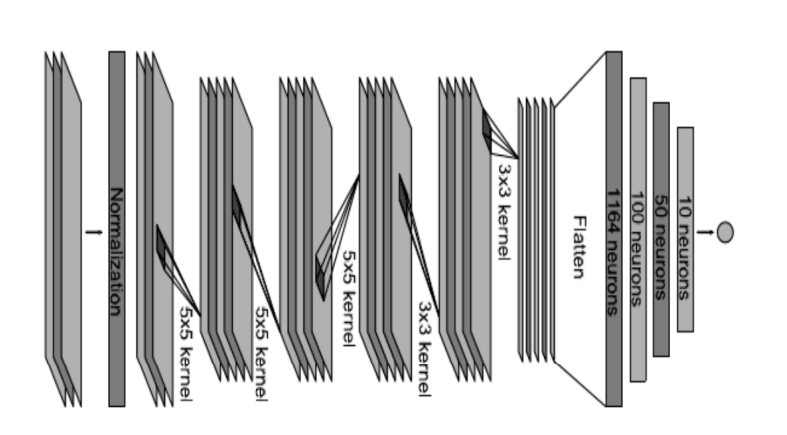
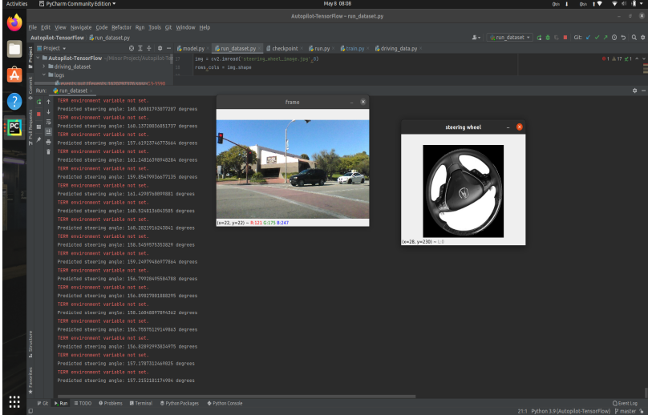
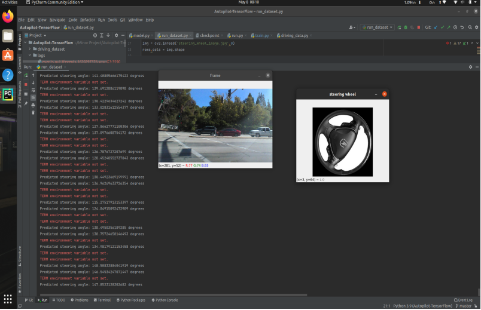

# Steering-Wheel-Angle-Prediction
Steering Wheel Angle Prediction In Self Driving Car

### About Dataset
The dataset is taken from the sullychen dataset which contains a total of45406
images. Images of the dataset are recorded from a car dashcam with
labelled steering angles. It contains continuous images of the video. Dataset is later
plotted into two categories: train and test. After splitting the dataset convolutional
neural networks (CNN) is used to train the model.

### Image Preprocessing
Images of the dataset are divided into training and test. Images of both sets are
cropped from the top and only lower (150 pixels) part is taken we are only concerned 
with roads in images. Then resized from 455 X 150 to 200 X 66, after which
normalized (dividing by 255) for easier computation

### Model Architecture

 

### Output
 
 

This work supports the notion that Autonomous Vehicles can work using convolutional neural networks trained model. it exhibited that CNNs are able to
learn without decomposition into road detection or lane detection, semantic abstraction, path planning, and control. The CNN is able to learn road and lane characteristics from a sparse training signal.
This project implemented a combination of computer vision techniques and a
CNN model that can minimize the unsafe behaviour of Autonomous Vehicles.

Much of implementation time was spent on setting up the environment. We can infer from
the outcomes that deep learning is one of the safest and accurate approaches for autonomous vehicles, therefore we believe that future projects will profit incredibly
from presenting a framework that uses the merits of computer vision-based techniques with the computational potential of the CNN model
